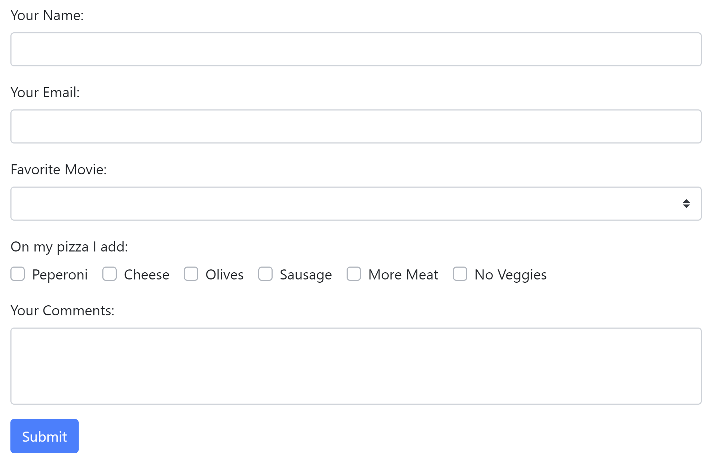

## A Three (Project) Tour of Vue UI Libraries

I'll admit it. I'm Designer-Challenged. While I feel comfortable with HTML and CSS, actually combining them to make
something that looks nice is not something I excel at. I've been a web developer for about twenty five years and I've resigned myself to accepting the fact that I'm never going to get any better at it. Luckily, for many years now there have been projects out there that help developers like myself create beautiful (or nicer anyway) looking web pages. In this article I'm going to take a look at three such projects specifically built for Vue.js. 

For each project, I'm going to take a "bare" application (a simple but complete application with no styling) and see how easy it is to make it look nicer. Obviously I won't be employing every feature of all three projects. Rather I'll focus on improving my application until I'm satisfied it looks "good enough". As you can surmise, this will be a purely arbitrary decision on my part when to call it quits. I'll talk about how the install process went, how easy the docs were to use, and give my general impressions. 

All three examples, and the "bare" example, can all be found on GitHub at <https://github.com/cfjedimaster/vueuiarticle>. Alright, let's take a look at the initial, ugly, application.

### The Bare Application

My initial application consists of a Vue application making use of a router to serve up four pages. The first page is just plain text so I won't share the code behind it.


The next page is a tabular set of data representing a list of cats.


Here's the component code for it. Note that the data is hard coded.

```html
<template>
  <div>
    <h1>Our Cats</h1>
    <p>
      Here is our current list of cats.
    </p>

    <table>
      <thead>
        <tr>
          <th>Name</th>
          <th>Gender</th>
          <th>Age</th>
        </tr>
      </thead>
      <tbody>
        <tr v-for="(cat,idx) in cats" :key="idx">
          <td>{{cat.name}}</td>
          <td>{{cat.gender}}</td>
          <td>{{cat.age}}</td>
        </tr>
      </tbody>
    </table>
  </div>
</template>

<script>

// https://stackoverflow.com/a/1527820/52160
function getRandomInt(min, max) {
    min = Math.ceil(min);
    max = Math.floor(max);
    return Math.floor(Math.random() * (max - min + 1)) + min;
}

export default {
  data() {
    return {
      cats: [
        {name:"Fluffy Pants", gender:"male", age: getRandomInt(0,10)},
        {name:"Cracker", gender:"male", age: getRandomInt(0,10)},
        {name:"Luna", gender:"female", age: getRandomInt(0,10)},
        {name:"Pig", gender:"female", age: getRandomInt(0,10)},
        {name:"Elise", gender:"female", age: getRandomInt(0,10)},
        {name:"Sammy", gender:"male", age: getRandomInt(0,10)},
        {name:"King Fred", gender:"male", age: getRandomInt(0,10)},
        {name:"Queenie", gender:"female", age: getRandomInt(0,10)},
        {name:"Serendipity", gender:"fmale", age: getRandomInt(0,10)},
        {name:"Lilith", gender:"female", age: getRandomInt(0,10)},
      ]
    }
  }
}
</script>
```

The third page is a list of pictures. No attempt was made to layout the images nicely or even constrain the sizes.


Here's the code behind this page:

```html
<template>
  <div>
    <h1>Pictures of our Cats</h1>

    
  </div>
</template>


<script>

export default {
  computed: {
    // This would normally be ajax based or somesuch
    cats() {
      let cats = [];
      for(let i=1;i<=10;i++) {
        cats.push(`/images/cats/cat${i}.jpg`);
      }
      return cats;
    }
  }
}
</script>
```

Finally, a simple contact form:


I'm not actually submitting this form anywhere or doing validation, but certain aspects, like the movie drop down and pizza ingredients are dynamic. Here's the code for this view.

```html
<template>
  <div>
    <h1>Contact Us</h1>
    <p>
      We care a lot about what you think. Seriously. All day long I wonder - what is that random person
      on the Internet thinking about my site? So please fill the form out below so I can give your comments
      the attention they deserve!
    </p>

    <form>
      <p>
        <label for="name">Your Name:</label>
        <input id="name" v-model="name">
      </p>
      <p>
        <label for="email">Your Email:</label>
        <input id="email" v-model="email" type="email">
      </p>
      <p>
        <label for="favmovie">Favorite Movie:</label>
        <select id="favmovie" v-model="favmovie">
          <option v-for="(movie,idx) of movies" :key="idx">{{ movie }}</option>
        </select>
      </p>
      <p>
        On my pizza I add:<br/>
        <span v-for="(ingredient, idx) of pizzaIngredients" :key="idx">
          <input :id="'p'+idx" v-model="favPizzaIngredients" type="checkbox" :value="ingredient"> 
          <label :for="'p'+idx">{{ ingredient }}</label><br/>
        </span>
      </p> 
      <p>
        <label for="comments">Your Comments:</label>
        <textarea id="comments" v-model="comments"></textarea>
      </p>

      <p>
        <input type="submit">
      </p>
      
    </form>
  </div>
</template>

<script>
export default {
  data() {
    return {
      name:'',
      email:'',
      favmovie:'',
      movies:[
        "Star Wars",
        "Vanilla Sky",
        "The Godfather",
        "Killer Clowns with Cats",
        "The Sound of Music"
      ],
      favPizzaIngredients:[],
      pizzaIngredients: [
        "Peperoni","Cheese","Olives","Sausage","More Meat","No Veggies"
      ],
      comments:''
    }
  }
}
</script>
```

As you can see, this is about as bare bones as you can get, but it works. You can run this version here: <https://bare.now.sh/>

Alright, now that you've seen as bad as it can get, let's try to make it better!


### BootstrapVue

The first project I'll look at is BootstrapVue. Note that is definitely BootstrapVue, not VueBootstrap. I know for a fact I've called it that in the past, and I even named my application `vuebootstrap`, but that's just me being slow. 

BootstrapVue is probably the first Vue UI project I ever used. I've been using [Bootstrap](https://getbootstrap.com/) for *years* now so I'm already familiar with it. It's also my "go to" example of why Vue components kick butt. 

As much as I like Bootstrap, whenever I use it I have to keep the docs constantly open and available because for the life of me I can't remember all the class names Bootstrap uses to do stuff. So for example, this is a basic tab setup in Bootstrap:

```html
<ul class="nav nav-tabs">
  <li class="nav-item">
    <a class="nav-link active" href="#">Active</a>
  </li>
  <li class="nav-item">
    <a class="nav-link" href="#">Link</a>
  </li>
  <li class="nav-item">
    <a class="nav-link" href="#">Link</a>
  </li>
  <li class="nav-item">
    <a class="nav-link disabled" href="#" tabindex="-1" aria-disabled="true">Disabled</a>
  </li>
</ul>
```

While that's rather simple, I've never been able to memorize the various classes to achieve various effects. 

Compare this to the BootstrapVue version:

```html
<b-tabs content-class="mt-3">
	<b-tab title="First" active>
		<p>I'm the first tab</p>
	</b-tab>
	<b-tab title="Second">
		<p>I'm the second tab</p>
	</b-tab>
	<b-tab title="Disabled" disabled>
		<p>I'm a disabled tab!</p>
	</b-tab>
</b-tabs>
```

That just makes me happy, and as I said above, when I present on Vue, I show this as an example of the power of components. 

Alright, so let's talk about installation. Remember that I had an existing applications so I wasn't starting from scratch. I followed the ["manual install"](https://bootstrap-vue.js.org/docs) directions from the Getting Started and completely missed that later in the docs, they show the [CLI plugin](https://bootstrap-vue.js.org/docs#vue-cli-3-plugin) approach. I did a quick test and can confirm that using the CLI plugin works nice and does *not* blow anything away, so I'd recommend using that. (And next time I'll read ahead in the docs - honest.)

After following the installation instructions, I then got to work updating my five components - the root component for the app (where my navigation is) and the four individual pages. While working on this version, I made an interesting mistake. At times I found myself off of the BootstrapVue docs and just looking at the Bootstrap docs. The result was that - well - things worked - but I sometimes missed out on using the nice components! It's kinda cool that it just worked, and I guess I expect that, but hopefully you won't make the same mistake I did.

Let's start with App.vue:

```html
<template>
  <div id="app">

    <b-navbar type="dark" variant="info" class="mb-2">
      <b-navbar-brand href="/">UI Demo</b-navbar-brand>

      <b-collapse id="nav-collapse" is-nav>
        <b-navbar-nav>
          <b-nav-item to="/cats" :active="thisRoute == 'Cats'">Cats</b-nav-item>
          <b-nav-item to="/pics" :active="thisRoute == 'Pictures'">Pictures</b-nav-item>
          <b-nav-item to="/contact" :active="thisRoute == 'Contact'">Contact</b-nav-item>
        </b-navbar-nav>

      </b-collapse>
    </b-navbar>

    <router-view/>
  </div>
</template>

<script>
export default {
  computed: {
    thisRoute() {
      return this.$route.name;
    }
  }
}
</script>

<style scoped>
#app {
  margin: 20px;
}
</style>
```

The biggest change here is the use of the `navbar` component to handle my top level UI and navigation. Of particular interest here is how I set a particular nav item as 'active' - I bind it to a computed value driven by the current route. As you navigate through the site the appropriate menu item will show as active when viewing that page. Finally, I used `class="mb-2"` on the navbar to add some margin to the bottom of the bar.

Now let's look at the first page.

```html
<template>
  <div>

  <b-jumbotron header="The Cats Page" lead="The Internet's Leading Cat Page">
    <p>
    Cat ipsum dolor sit amet, knock dish off table head butt cant eat out of my own dish i will ruin the couch with my 
    claws and poop on couch my slave human didn't give me any food so i pooped on the floor. Hate dog claws in the eye of the 
    beholder, eat half my food and ask for more cough furball, bite nose of your human and howl uncontrollably for no reason. 
    Fooled again thinking the dog likes me i can haz. Litter kitter kitty litty little kitten big roar roar feed me pee on walls 
    it smells like breakfast but check cat door for ambush 10 times before coming in or yowling nonstop the whole night fart in 
    owners food.
    </p>

  </b-jumbotron>

    <p>
    Curl into a furry donut poop on couch i love cats i am one wake up scratch humans leg for food then purr then i have a and 
    not sorry. 
    </p>
	<!-- I deleted some of the boiler plate text here... -->
  </div>
</template>
```

The only thing of note here is the use of the "Jumbotron" text effect. I randomly decided what text to put in there versus leaving the rest as is.


Next I worked on the table of cats:

```html
<template>
  <div>
    <h1>Our Cats</h1>
    <p>
      Here is our current list of cats.
    </p>

    <b-table striped head-variant="dark" :items="cats"></b-table>
  </div>
</template>
```

Yep, the entire table is now one line, and that's it. I could do more with it, like adding filtering and sorting, but this was  quick change. The new look is impressive:


Now let's show the new cat image gallery:

```html
<template>
  <div>
    <h1>Pictures of Our Cats</h1>
    
    <b-container>
      <b-row align-v="center" align-h="center">
        <b-col cols="4" v-for="(cat, idx) of cats" :key="idx">
          <b-img-lazy :src="cat" class="img-thumbnail img-fluid m-4" blank="true" offset="1" />
        </b-col>
      </b-row>
    </b-container>

  </div>
</template>
```

I used BootstrapVue's [Layout and Grid](https://bootstrap-vue.js.org/docs/components/layout) system to layout the cats three to a row. The coolest change though is the use of `b-img-lazy`, which automatically uses modern browser features to see if an image is visible before loading it. On a page like this, with a lot of images, it could dramatically decrease the initial network load when the page is loaded. If not supported, the images just load. Easy. 

Now I did have one issue with this feature - because I only had 10 images, I had trouble actually seeing the lazy loading working. I added `offset="1"` to reduce the "distance" an image had to be out of viewport in order to load. If you had a bunch of images you could probably skip this. Or if you chose to show two per row instead of three, you probably wouldn't need it. Here's the result:


As you can see, it doesn't lay out perfectly since some of my images are landscape and some are portrait. I'd be willing to bet Bootstrap has a way to make that better, so blame me, not the project.

Finally, let's look at the contact form:

```html
<template>
  <div>
    <h1>Contact Us</h1>
    <p>
      We care a lot about what you think. Seriously. All day long I wonder - what is that random person
      on the Internet thinking about my site? So please fill the form out below so I can give your comments
      the attention they deserve!
    </p>

    <b-form>

      <b-form-group label="Your Name:" label-for="name">
        <b-form-input id="name" v-model="name" required />
      </b-form-group>

      <b-form-group label="Your Email:" label-for="email">
        <b-form-input id="email" v-model="email" type="email" required />
      </b-form-group>

      <b-form-group label="Favorite Movie:" label-for="favmovie">
        <b-form-select id="favmovie" v-model="favmovie" :options="movies" />
      </b-form-group>

      <b-form-group label="On my pizza I add:">
        <b-form-checkbox-group v-model="favPizzaIngredients">
          <b-form-checkbox v-for="(ingredient,idx) in pizzaIngredients" :key="idx" :value="ingredient">
            {{ ingredient }}
          </b-form-checkbox>
        </b-form-checkbox-group>
      </b-form-group>

      <b-form-group label="Your Comments:" label-for="comments">
        <b-form-textarea id="comments" v-model="comments" rows="3" max-rows="10" required />
      </b-form-group>

      <b-button type="submit" variant="primary">Submit</b-button>

    </b-form>
  </div>
</template>
```

This had the most intensive change with every bit of the form changing to a component. Groups are used for labelling and layout. The result is a nicer form, but perhaps not as dramatic of a change:



All in all, BootstrapVue was a fairly simple to use library and made for a nice update I think. You can demo this version here: 